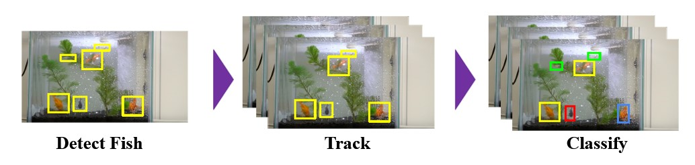
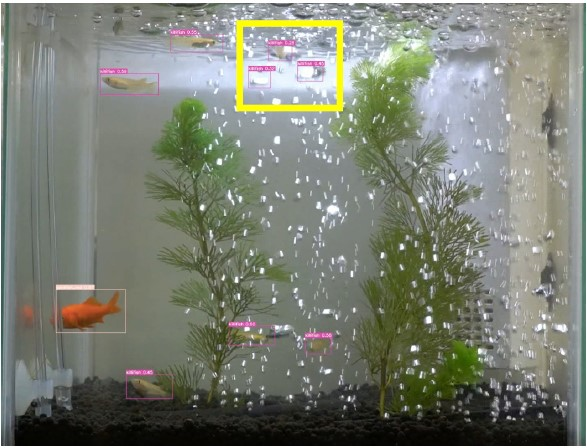
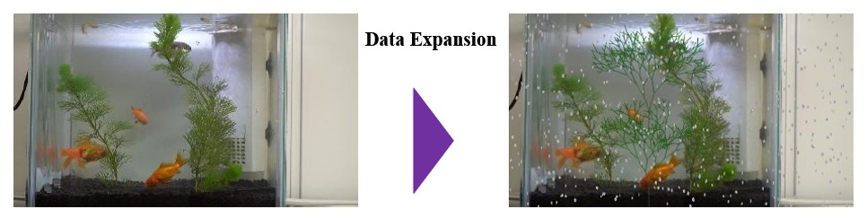
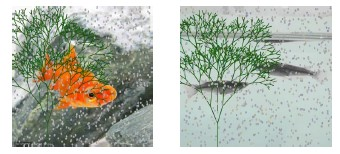
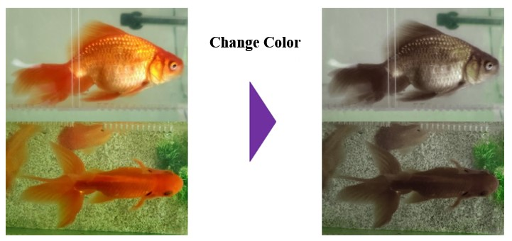

# Summer Camp 2022
This is the summer camp project for [Appearance Inspection Algorithm Contest 2022](http://alcon.itlab.org/detail/).

## Task Summary
  - Objective: Detect, track and count swimming fishes in the water using provided videos
  - Target: Swimming fish in the tank
  - Grade Items: Accuracy and processing time of counting fish
   

   Note: There are five types of fish. They are Medaka, Kingfish (black), Small gold (red), Small gold (black) and Eyeball.

# How to solve the problem
First, detect the fish, then track, and finally classify them all. 

1. Fish Detection: Use YOLOv5 to detect the fish, however, sometimes the bubbles are detected as fish. Therefore, counting all the bbox numbers and the most frequent number is the number of fish.

2. Dataset Expansion: Expanding the complexity of the dataset can increase the accuracy of fish counting. 
 - For occlusion   
     Use a fractured tree to simulate the seaweed, whereas the bubbles’ size, angle, and color vary from time to time as well. 

     

     Add bubbles and seaweed to the images. 
      
 - For increasing numbers of images   
     Download images from Google and change the color of the fish.
     
3. Tracking: Apply StrongSORT to the program to separate each case. 
4. Classification: Deep Metric Learning 

